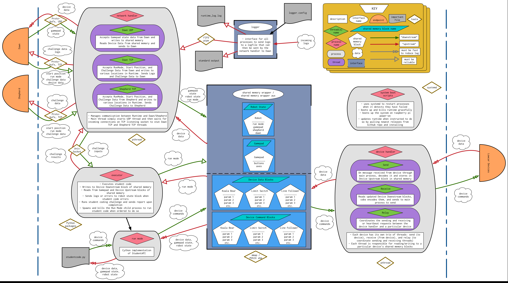

# PiE C-Runtime

Welcome to the PiE Runtime repo! If you're new a staff member, then welcome to PiE, and welcome to the Runtime project! We're so glad to have you with us, and that you chose to give Runtime a shot! This README will (hopefully) be a nice overview of what Runtime is all about and how it's built, and answer some basic questions you might have about our project and this code. If you have any questions, please ask the Runtime project manager(s)! We highly encourage you to read through the whole thing, it'll be really useful, we promise! Without further ado, let's get started...

## What is Runtime?

As you know, Pioneers in Engineering is a student organizations that hosts a robotics competition for underserved high schools in the SF Bay Area. To do this, we build everything in house, including our software. So, when the students get their robotics kits to build their robots, it includes motors, sensors, servos, gears, metal, and a computer to actually run their robot. **Runtime is responsible for writing the software that runs on that computer (a Raspberry Pi, at the time of this writing), as well as the software that runs on the Arduinos attached to all the motors, sensors, and servos.**

Students also write their own code to control their robots, which they upload to the robot for it to run. Most of their code consists of things like "when the Y button on the gamepad is pressed, I want to move this servo to this position" which does something that scores points. **The code that Runtime writes for the Raspberry Pi needs to be able to run the student's code and translate that into actual commands to the sensors on the robots.**

Students use the "Dawn" computer application (also made by PiE) running on their laptops to write their code, connect their Xbox controllers (we call them "gamepads" in Runtime) to, and view the current state of the various devices attached to their robot. **Runtime's software must be able to communicate with Dawn to receive commands and student code, and report device data back to Dawn.**

During the competition, the software "Shepherd" (another PiE software project) is used to control the field and run the game. Shepherd connects to the robots in order to tell them which side of the field they're on, where the robots are starting within each side, and when to go into autonomous (auto) mode, teleoperated (teleop) mode, and idle mode. **Runtime's software must be able to communicate with Shepherd to receive these commands and report any status updates back to Shepherd.**

The devices that are attached to the robot (motors, servos, sensors) must, of course, interact with the software on the Raspberry Pi. When the student's code wants to command a motor or servo to a new speed or position, it needs to send that information to the Arduino on the device that is controlling it. When the student's code wants to read the value of a sensor, the software on the Raspberry Pi must make that information available to it. And, the software on the Raspberry Pi must be able to detect when new devices have connected, or devices have been disconnected (unplugged) from the robot. **Runtime is responsible for ensuring all of this behavior.**

So, as you can see, Runtime does a lot! But, how does it all work?

## Design Principles

**Runtime is all about speed and reliability.** 

It needs to be fast, so that student code doesn't lag, so that inputs from the gamepads don't lag, and so that it can handle as many devices as the students would ever put onto their robot without crashing or noticeable slowing down of the system. This guided a lot of our early design decisions, and is part of the reason why we chose to write the entire system in C. <sup id="return1">[1](#footnote1)</sup>

Runtime also needs to be easy to debug and very robust, because nothing frustrates a student more than when the robot's software breaks while they're working, and it has nothing to do with their code. They get even more frustrated when they bring the broken robot to PiE staff members, who then take hours to try and solve the problem because the staff members can't debug the problem efficiently. 

Lastly, Runtime should be as easy to understand, set up, and maintain as possible, because the last thing we want is for the learning curve for staff to become so steep that it becomes impossible to keep the code stable, simple, and healthy. 

With that said, we now see the need for the following design principles:

* **Keep It Simple, Stupid (KISS)**. In Runtime, this means that we want to keep the number of dependencies on third-party libraries to a minimum. This reduces the complexity of building Runtime. Third party-libraries also often have incomplete or questionable documentation; having fewer third-party dependencies means that there is less documentation new staff members have to read in order to begin understanding and working on Runtime. 
* **Document, document, document**. As you can probably tell by the length and detail in this README, we take our documentation seriously. Mark your TODO items. Describe your functions. Name things well. Write and update READMEs whenever possible. We need to document everything to make it easy for staff to onboard, and for seasoned staff to maintain and extend the code.
* **Be Able to Log Anywhere**. Runtime has a logger that can send logs from anywhere within the system to a file, terminal, or over the network to Dawn if Dawn is connected. It is crucial that this logger be maintained, and for log statements to be added into the program wherever necessary (including in the Arduino devices). When a problem arises, staff must be able to turn on these logs, allowing them to see exactly what is happening in the system from somewhere, which enables efficient debugging.
* **Consider All Posssibilities**. Try to consider all the errors and situations possible. What should happen in each case? Should Runtime restart? Should it handle the error and continue as normal? Should it revert to some default behavior? This all helps make Runtime as robust as possible, helps us debug efficiently when Runtime crashes, and helps keep students happy when Runtime doesn't crash.
* **Test, test, test**. It is hard to test such a large system, but if at all possible, the effort must be made to test our code. 

## Runtime Diagrams

This is a diagram of the entirety of Runtime. To download and view in detail, see `images/Runtime-Diagram.png`:



## Overall Structure

Runtime can be divided into a few neatly containerized parts:

* **The Network Handler**: abbreviated `net_handler`, this is a process in Runtime, and is responsible for all communication between the Raspberry Pi and Dawn, and between the Raspberry Pi and Shepherd.
* **The Device Handler**: abbreviated `dev_handler`, this is a process in Runtime, and is responsible for all communication between the Raspberry Pi and all the devices that are attached to the robot at any given time.
* **The Executor**: this is a process in Runtime, and is responsible for running the student code that is uploaded to the robot from Dawn.
* **The Shared Memory Wrappers**: abbreviated `shm_wrapper` and `shm_wrapper_aux`, these two are tools that facilitate the efficient communication between the above three processes. Think of these wrappers as the "glue" that holds the three processes together, and lets them talk to each other.
* **The Logger**: this is the tool that Runtime uses to gather all the logs generated at various places in the code (including by student code) and outputs them to a terminal window, to a file, to Dawn over the network, or to some combination of the three.
* **The Device Code**: codenamed "`lowcar`" <sup id="return2">[2](#footnote2)</sup> this is the set of all the code on the Arduinos that directly control an individual device that is connected to the robot. All of this code is collectively called the "lowcar library".
* **The Systemd Services**: this is a collection of system services that allow Runtime to start automatically when the Raspberry Pi is turned on, recover when Runtime crashes, and automatically get and install new Runtime updates from this Github.
* **The Runtime Utility**: this is a collection of helper functions and defined constants that are used throughout Runtime. Most of them have to do with certain Runtime configuration values, maximum sizes for certain messages, or retrieving information about the different types of `lowcar` devices.

This README will not go into each of these parts into exhaustive detail; explanations for each part can be found in the corresponding folder in the repo for the interested reader. However, we will describe briefly the data that flows between the various parts, and the manner in which that data is sent:

* `net_handler` communicates with both Dawn and Shepherd. It receives start and stop commands, input data for the coding challenge, and information about the gamepad state. It sends log messages, data about the connected devices, and output data for the coding challenge. This data is sent over both TCP and UDP connections (depending on the type of data) to Shepherd and Dawn, and the data is packaged using Google Protocol Buffers.
* `dev_handler` and `net_handler` are connected via `shm_wrapper`. This connection is used for the `net_handler` to fetch the most recent state of the connected devices, which is then sent to Dawn for the students to see.
* `executor` and `net_handler` are connected via `shm_wrapper_aux` and a UNIX Socket. The connections are used to pass information about the coding challenge (both inputs to the functions and the student's outputs), and for `executor` to know what to run at any given time (autonomous mode, teleop mode, coding challenges, or idle).
* `executor` and `dev_handler` are connected via `shm_wrapper`. This connection is used for `executor` to send commands to the attached devices (tell a motor to run at a certain speed, move a servo to certain position, etc.), and for `dev_handler` to serve `executor` with the device data that it needs to run the student code.
* `dev_handler` communicates with `lowcar` via serial connection. This connection is used to poll for new devices, detect when devices have disconnected, and send device data and commands between the Raspberry Pi and the Arduinos.
* All three processes output log messages through the `logger` tool. If logs are to be sent over the network to Dawn, those logs are put into a FIFO pipe which is opened by `net_handler`, where the logs are processed and sent to Dawn.

## Concepts

Runtime uses a **lot** of systems concepts, which is hopefully why you're here--to learn about systems! The following is a list of some various concepts that you'll be exposed to in Runtime, along with where they are used within Runtime. Keep in mind, this is _not_ a list of prerequisite knowledge you need to have in order to work on Runtime!

* **Networking**
    * Used to connect Runtime to Dawn and Shepherd
    * **User Datagram Protocol (UDP)**
	    * This networking standard for transmitting data between two machines on a network is useful when transferring packets of data where dropping, reordering, or duplicating packets occasionally is tolerable
		* In Runtime, used for Runtime to communicate device data to Dawn, and Dawn to communicate gamepad state to Runtime
	* **Transmission Control Protocol (TCP)**
		* This networking standard for transmitting data between two machines on a network is useful when transferring packets of data that needs to be reliably sent and received
		* In Runtime, used for Runtime to communicate all other data between itself and Dawn or Shepherd
	* **Sockets**
		* These objects are used by computers to communicate with other computers on the network. A connection over a network is made when a socket on one machine and another socket somewhere else on the network begin sending information to each other
		* In Runtime, used to make connections with Dawn and Shepherd. Also used between `net_handler` and `executor` to communicate about the coding challenges
* **Shared Memory**
	* These special files can be used for different processes to communicate messages, especially structured messages. Shared Memory is the fastest type of interprocess communication (IPC)
	* In Runtime, it is used to enable the fast transfer of most data (especially the high-throughput data) through the system
* **FIFO Pipes**
    * These special files can be used for different processes to communicate messages, especially unstructured messages where the order in which the messages come is important
	* In Runtime, used to transfer logs between the logger and `net_handler` before those logs are sent to Dawn
* **Serial Communication**
	* Serial communication happens whenever two devices communicate information byte-by-byte (usually over a wired connection), with no protocol or breaking up of large messages into smaller packets when necessary
	* In Runtime, `dev_handler` and the `lowcar` devices communicate over serial connections
* **Thread Management**
	* Threads are essentially ways to run different sections of code within the same process simultaneously. They are very useful for breaking up the work a process needs to do into several different, well-defined "parts"
	* In Runtime, they are used by all processes to divide up their tasks appropriately and prevent logic in one section of code from crashing or blocking logic in another section
* **Process Management**
	* Processes can also spawn and kill other processes. Doing this is useful when you want to enforce a separation between two processes, and creating a new thread is not enough of a separation; or when you want to run a separate piece of code and ensure that everything related to that process is stopped cleanly when it exits
	* In Runtime, they are used by `executor` to run the student code, to ensure that nothing that is done in student code can affect the `dev_handler` and make it crash

## Dependencies

Remember, one of the design principles is KISS. Nevertheless, Runtime is a complex system and will require effort to learn and understand. Hopefully this list does not seem too daunting to you! <sup id="return3">[3](#footnote3)</sup>

### Commonly Used Tools

As a baseline, Runtime uses the following commonly used tools that should already be installed on your machine (if you don't have these, ask the Runtime Project Manager to help you install them):

* Python 3.7 or later: we wrote `executor` using Python 3.7 / 3.8, so we only guarantee that these versions work as of now (although Python 3.6 should also work).
* `gcc`: short for "GNU C Compiler", we use this compiler to generate executables from C source code.

Additionally, the Raspberry Pi uses a distribution of the Linux operating system (OS) called "Raspbian", a slight variant of the extremely popular "Debian" Linux. We tested Runtime to work well on Linux systems, but getting it to work properly on MacOS is difficult (and it definitely does not work on Windows). **It's highly recommended that you try to install a dual boot on your computer with some distribution of Linux (preferably Debian or Ubuntu) in order to properly build and run Runtime.**

### Third-party Library Dependencies

Runtime has the following third-party library dependencies:

* `Cython`: this library is used by `executor` to implement the Student API in a way that is both callable from Runtime (which is written in C) and from student code (which is written in Python)
    * Documentation: https://cython.readthedocs.io/en/latest/
* Google `protobuf` and `protobuf-c`: Google `protobuf` is the library that we use to serialize our messages between Runtime and Shepherd, and Runtime and Dawn. The brief explanation of how it works is this: the user defines the structure of a message in "protobuf language", and saves it as a `.proto` file. Google's protobuf compiler will then take that `.proto` file and generate code that can be used in a desired target language to serialize and deserialize ("pack" and "unpack" in the language of protobufs) messages of that type. Since Google's protobuf compiler does not have native support for C, we need to use the third party library `protobuf-c` to generate C code. (But `protobuf-c` makes use of Google's library, so we still need it).
    * `proto3` language documentation / guide: https://developers.google.com/protocol-buffers/docs/proto3
	* `protobuf` Github: https://github.com/protocolbuffers/protobuf
	* `protobuf-c` Github: https://github.com/protobuf-c/protobuf-c

#### Installing Cython

On Debian / Raspbian Linux:

1. `sudo apt-get -y install python3-distutils` (get some utility functions)
2. `sudo apt-get -y install python3-dev`       (get `<Python.h>`, `libpython3.7m.so`)
3. `sudo apt-get -y install python3-pip`       (get `pip`)
4. `python3 -m pip install Cython`             (get `Cython` using `pip`)

#### Installing Google Protobufs and `protobuf-c`

On Debian/Raspbian Linux, and MacOS:

1. From `https://github.com/protocolbuffers/protobuf/releases`, download `protobuf-cpp-<release>.tar.gz` and extract it (for help, click [here](#extract))
2. From `https://github.com/protobuf-c/protobuf-c/releases` download `protobuf-c-<release>.tar.gz` and extract it (for help, click [here](#extract))
3. You may need to install some tools (`libtool`, `pkg-config`, `g++`). To check if you have them already, run `which <tool-name>`, and if the computer spits out a path, then you don't have to install it. For example, to check if you have `libtool`, run `which libtool` and if you have it you should get something like `/usr/bin/libtool` or `/usr/local/bin/libtool`
	1. to install a tool you don't have, run `sudo apt-get -y install <tool-name>`, replace `<tool-name>` with what you want to install.
4. `cd` into the folder for `protobuf-cpp-<release>.tar.gz` and run:
	1. `./configure`
	2. `make` (this takes a while)
	3. `make check` (this takes a while)
	4. `sudo make install`
5. `cd` into the folder for `protobuf-c-<release>.tar.gz` and run:
	1. `./configure`
	2. `make`
	3. `sudo make install`
6. (optional) Check to make sure it works by recreating the example `AMessage` at the protobuf-c wiki: https://github.com/protobuf-c/protobuf-c/wiki/Examples
7. (optional) To view `protobuf-c` documentation:
	1. Install `doxygen`: `brew install doxygen` on MacOS, `sudo apt-get -y install doxygen` on Linux
	2. Repeat steps 5.i and 5.ii from above in the `protobuf-c` directory, then do `make html`
	3. Then do `open -a <web_browser> html/index.html` to see the documentation in your web browser (replace `<web_browser>` with your favorite browser: `Opera`, `Safari`, `Chrome`, etc.)

#### To download and extract a `tar` file <a name="extract"> </a>
**First**, download the tar archive into your current working directory, for example:

Linux:
```
wget https://github.com/protocolbuffers/protobuf/releases/download/<release>.tar.gz`
```
MacOS:
```
curl -o <name-of-file> https://github.com/protocolbuffers/protobuf/releases/download/<release>.tar.gz
```
`<name-of-file>` is what you want the downloaded file to be named. You may need to install `curl` with `brew install curl`.

**Then**, extract the files from the `tar` archive file, for example:

Linux, MacOS:
```
tar -xvf protobuf-cpp-<release>.tar.gz
```

### C and POSIX Standard Library Headers

Runtime uses the folllowing C and POSIX standard library headers, in rough order from most commonly used to least commonly used (these all do not require additional installation before they can be used on any POSIX-compliant systems):

* `stdio.h`: for standard input/output (ex. `printf`)
* `stdlib.h`: C standard utility functions (ex. `sleep`, `malloc`, `free`)
* `stdint.h`: C standard integer types (ex. `uint16_t`, `uint32_t`)
* `pthread.h`: for threading functions (ex. `pthread_create`, `pthread_mutex_lock`, `pthread_cond_signal`)
* `unistd.h`: for miscellaneous input/output functions and functions (ex. `read`, `write`, `open`, `close`, `SEEK_END`)
* `errno.h`: for a bunch of error constants and functions (ex. `EEXIST`, `EWOULDBLOCK`, `EINTR`)
* `arpa/inet.h`: for socket functions (ex. `inet_addr`, `bind`, `listen`, `accept`, `socket`)
* `netinet/in.h`: for socket address structures (ex. `struct sockaddr`, `struct sockaddr_in`)
* `sys/types.h`: for some system-defined types for holding various objects (ex. `sem_t` for semaphores)
* `semaphore.h`: for semaphores (ex. `sem_wait`, `sem_post`)
* `sys/mman.h`: for memory mapping used in shared memory (ex. `mmap`)
* `sys/time.h` and `time.h`: for measuring time (ex. `time_t`, `ctime`)
* `signal.h`: for signal handlers and signal constants (ex. `signal`, `SIGINT`)
* `string.h`: for string manipulation (ex. `strcpy`, `memset`)
* `stdarg.h`: for variable-length arguments used in `logger` (ex. `va_args`)
* `sys/stat.h`: for working with unconventional files (ex. `mkfifo`)
* `sys/wait.h`: for wait functions used in executor to wait for processes (ex. `waitpid`)
* `fcntl.h`: for constants used in opening and closing files (ex. `O_RDONLY`, `O_WRONLY`)

### Language-Supported Python Libraries

Runtime uses the following language-supported (i.e. not third-party) Python libraries to implement the Student API:

* `threading`: used for creating threads that run student-defined actions
* `sys`: used for redirecting `print` statements to the Runtime `logger`
* `builtins`: used to reference the built-in Python `print` function and change it

## Building Runtime

TODO!

## Running Runtime

TODO!

## Project Organization / Conventions

We use Github Issues to track what we're doing and future initiatives to take up. These issues are loaded into a Github Project and assigned to someone. That person (or people) will create a branch off of whichever branch seems logical to branch off of, and do the work there. 

Try to squash your changes locally before pushing to Github, so that you don't clog up the public repo's history with small commits. 

Commit messages should span multiple lines. Most people are taught to commit with `git commit -m "<commit message>"`, but if you drop the `-m` flag and just run `git commit`, `git` will automatically bring up a text editor for you to enter multi-lined commit messages. The first line should be about 5 - 7 words, prepended with an all-caps tag enclosed in square brackets that describes the part of Runtime you were working on. Then, in the lines below, put a bullet-pointed list of items that were completed in that commit. Each line in this list should also be no more than about 10 words. These rules help the messages display well in `git log` commands as well as on Github. Here is an example:
```
[DEV_HANDLER] relayer() calls get_endpoints()
- Allows relayer to try every interface to get endpoints
- Relayer cancels threads only if no interface has the interfaces
- Removed INTERFACE_IDX (which was hardcoding)
- Future: Maybe try every setting on every interface
```
When finished with the feature on your branch, submit a pull request to the branch that you branched off from and request the review of relevant people. Only after someone has reviewed your code and approved the pull request should you then merge (or rebase) your code onto your branch's parent branch (most often `master`).

We do work in two-week cycles. At the beginning of each cycle (or "sprint"), everyone in the project sets goals for what they want to get done during that sprint. At the beginning of each meeting, everyone gives a short update on how they're doing, and what they intend to finish during that meeting. At the end of the cycle, each team member gives a demo of what they finished during that sprint, and the team gives feedback and evaluates the person's work. Of course, this requires the goals to be specific enough to demonstrate during a demo. For example, a goal of "I want to speed up the threads in `dev_handler`" is not specific enough. How will you demonstrate that during a demo? How will you quantify the speedup? How will you measure the speedup? In contrast, a goal of "The executor will be able to successfully terminate student code when Dawn disconnects" is specific enough. You can very clearly demonstrate that this occurs during a demo.

TODO: For coding style conventions, see our style guide.

## Authors

The first version of `c-runtime` was written in the summer of 2020 (when we all had lots of time.... covid sux) nearly entirely by four people (all class of 2022):

* Ben Liao
* Ashwin Vangipuram
* Vincent Le
* Daniel Molina

Some inspiration and design was drawn from previous iterations of Runtime and Lowcar, written mostly by:

* Doug Hutchings
* Yizhe Liu
* Jonathan Lee
* Brose Johnstone
* Sam Zhou
* Brandon Lee

## Footnotes

**<a name="footnote1">1</a>**: Previous iterations of Runtime were written in Python; whether or not this was a good choice is up to the reader's discretion. [↩](#return1)

**<a name="footnote2">2</a>**: This name has an interesting origin. The code for the devices used to be in a completely separate PiE project called "Hibike" (pronounced HEE-bee-kay). Some members of Hibike who wrote much of the original Arduino code were avid fans of anime. So, they named the project Hibike after the anime "Hibike! Yufoniamu" (_Sound! Euphonium_). Later, some members who were not such avid fans of anime decided to pronounce "Hibike" as "HAI-bike", which sounds like the two English words "High Bike". Later still, when members decided to refactor the code to be more object-oriented, it was decided that a new name was needed for the project. Ben Liao coined the name "Low Car" as wordplay on "High Bike", and the name stuck. [↩](#return2)

**<a name="footnote3">3</a>**: Previous iterations of Runtime, which were written in Python, had some of these third-party dependencies: `zmq`, `protobufs`, `Cython`, as well as several large Python libraries (not all listed): `asyncio`, `threading`, `aio_msgpack_rpc`, `serial_asyncio`, `multiprocessing`, `glob`, `os`, `json` [↩](#return3)
