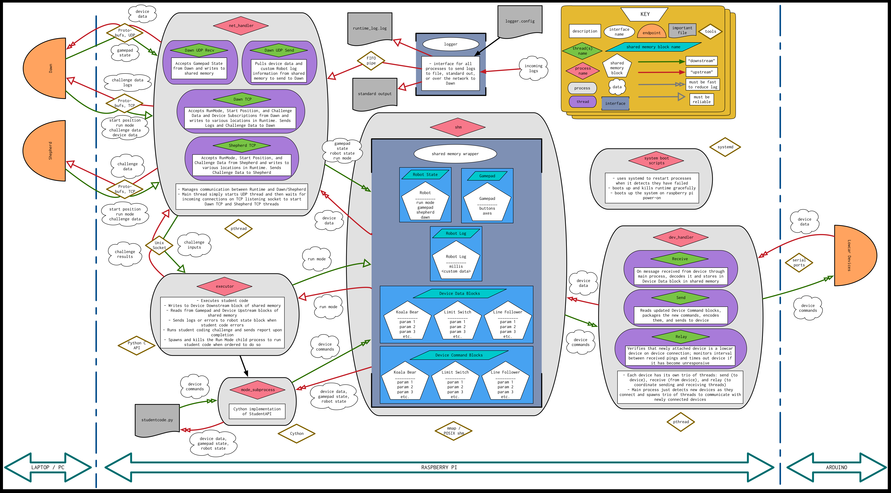

Travis CI Master Build 

# PiE Runtime

Welcome to the PiE Runtime repo! This README will only cover how to install, build, and run Runtime. If you want to learn more info about how Runtime works, or are a new member, please check out our wiki https://github.com/pioneers/c-runtime/wiki.

This is a diagram of the entirety of Runtime. To download and view in detail, see `docs/Runtime-Diagram.png`:



## Overall Structure

Runtime can be divided into a few neatly containerized parts:

* **The Network Handler**: abbreviated `net_handler`, this is a process in Runtime, and is responsible for all communication between the Raspberry Pi and Dawn, and between the Raspberry Pi and Shepherd.
* **The Device Handler**: abbreviated `dev_handler`, this is a process in Runtime, and is responsible for all communication between the Raspberry Pi and all the devices that are attached to the robot at any given time.
* **The Executor**: this is a process in Runtime, and is responsible for running the student code that is uploaded to the robot from Dawn.
* **The Shared Memory Wrappers**: abbreviated `shm_wrapper` and `shm_wrapper_aux`, these two are tools that facilitate the efficient communication between the above three processes. Think of these wrappers as the "glue" that holds the three processes together, and lets them talk to each other.
* **The Logger**: this is the tool that Runtime uses to gather all the logs generated at various places in the code (including by student code) and outputs them to a terminal window, to a file, to Dawn over the network, or to some combination of the three.
* **The Device Code**: codenamed "`lowcar`" <sup id="return1">[1](#footnote1)</sup> this is the set of all the code on the Arduinos that directly control an individual device that is connected to the robot. All of this code is collectively called the "lowcar library".
* **The Systemd Services**: this is a collection of system services that allow Runtime to start automatically when the Raspberry Pi is turned on, recover when Runtime crashes, and automatically get and install new Runtime updates from this Github.
* **The Runtime Utility**: this is a collection of helper functions and defined constants that are used throughout Runtime. Most of them have to do with certain Runtime configuration values, maximum sizes for certain messages, or retrieving information about the different types of `lowcar` devices.
* **The Scripts**: this is a collection of shell scripts that do general things to all of Runtime, such as build it, run it, and test it. There is also a tool to flash `lowcar` devices. All of them are called by the `runtime` script in the root directory.

In addition to these parts, there are a number of configuration files for Runtime to manage the various tools that we use. They are listed here, with a brief explanation about what they do:

* **`.dockerignore`**: this file lists out all of the directories, files, and other information that we do not want to include when building Runtime's Docker image.
* **`.gitignore`**: this file lists out all of the directories and files that we don't want in our Git repository. This includes things like executables, build files, and `.DS_Store`.
* **`.gitattributes`**: this file is purely for aesthetic purposes. It tells Github which files to exclude when calculating the repository language makeup you see in the repo (below the "Contributors" section in the sidebar on the web page that you're probably looking at right now).
* **`.travis.yml`**: this file tells Travis (the continuous integration tool that we use) what to run when checking if Runtime is working properly before a new feature is merged into the master branch. It is essentially responsible for running the integration tests and for updating Runtime's Docker image.
* **`docker-compose.yml`**: this file is used to give meaning to the command `docker-compose up`, which we have defined here to be a combination of the commands `docker build` and then `docker run`.
* **`runtime`**: this file is a convenience shell script that makes it easy to call the various other shell scripts in our directory, and allows us to issue intuitive commmands like `runtime build`, for example, which (expectedly) builds Runtime.

This README will not go into each of these parts into exhaustive detail; explanations for each part can be found in the corresponding folder's README in the repo as well as our wiki https://github.com/pioneers/runtime/wiki. However, we will describe briefly the data that flows between the various parts, and the manner in which that data is sent:

* `net_handler` communicates with both Dawn and Shepherd. It receives start and stop commands, input data for the coding challenge, and information about the gamepad state. It sends log messages, data about the connected devices, and output data for the coding challenge. This data is sent over both TCP and UDP connections (depending on the type of data) to Shepherd and Dawn, and the data is packaged using Google Protocol Buffers.
* `dev_handler` and `net_handler` are connected via `shm_wrapper`. This connection is used for the `net_handler` to fetch the most recent state of the connected devices, which is then sent to Dawn for the students to see.
* `executor` and `net_handler` are connected via `shm_wrapper_aux` and a UNIX Socket. The connections are used to pass information about the coding challenge (both inputs to the functions and the student's outputs), and for `executor` to know what to run at any given time (autonomous mode, teleop mode, coding challenges, or idle).
* `executor` and `dev_handler` are connected via `shm_wrapper`. This connection is used for `executor` to send commands to the attached devices (tell a motor to run at a certain speed, move a servo to certain position, etc.), and for `dev_handler` to serve `executor` with the device data that it needs to run the student code.
* `dev_handler` communicates with `lowcar` via serial connection. This connection is used to poll for new devices, detect when devices have disconnected, and send device data and commands between the Raspberry Pi and the Arduinos.
* All three processes output log messages through the `logger` tool. If logs are to be sent over the network to Dawn, those logs are put into a FIFO pipe which is opened by `net_handler`, where the logs are processed and sent to Dawn.


## Dependencies

Runtime is a complex system and will require effort to learn and understand. Hopefully this list does not seem too daunting to you!

### Commonly Used Tools

As a baseline, Runtime uses the following commonly used tools that should already be installed on your machine (if you don't have these, ask the Runtime Project Manager to help you install them):

* Python 3.7 or later: we wrote `executor` using Python 3.7, so we only guarantee that these versions work as of now (although Python 3.6 should also work).
* `gcc`: short for "GNU C Compiler", we use this compiler to generate executables from C source code.

Runtime is designed to be used on the Raspberry Pi, and with a distribution of the Linux operating system (OS) called "Raspbian", a slight variant of the extremely popular "Debian" Linux. We tested Runtime to work well on Linux systems. If you do not have a Linux system, please instead use Docker (might even be easier than using Linux). To learn more about it, check out the README in the `docker/` folder.

### Third-party Library Dependencies

Runtime has the following third-party library dependencies:

* `Cython`: this library is used by `executor` to implement the Student API in a way that is both callable from Runtime (which is written in C) and from student code (which is written in Python)
    * Documentation: https://cython.readthedocs.io/en/latest/
* Google `protobuf` and `protobuf-c`: Google `protobuf` is the library that we use to serialize our messages between Runtime and Shepherd, and Runtime and Dawn. The brief explanation of how it works is this: the user defines the structure of a message in "protobuf language", and saves it as a `.proto` file. Google's protobuf compiler will then take that `.proto` file and generate code that can be used in a desired target language to serialize and deserialize ("pack" and "unpack" in the language of protobufs) messages of that type. Since Google's protobuf compiler does not have native support for C, we need to use the third party library `protobuf-c` to generate C code. (But `protobuf-c` makes use of Google's library, so we still need it).
    * `proto3` language documentation / guide: https://developers.google.com/protocol-buffers/docs/proto3
	* `protobuf` Github: https://github.com/protocolbuffers/protobuf
	* `protobuf-c` Github: https://github.com/protobuf-c/protobuf-c

#### Installing Cython

On Debian / Raspbian Linux:

1. `sudo apt-get -y install python3-dev`       (get `<Python.h>`, `libpython3.7m.so`)
2. `sudo apt-get -y install python3-pip`       (get `pip`)
3. `python3 -m pip install Cython`             (get `Cython` using `pip`)

#### Installing Google Protobufs and `protobuf-c`

On Debian/Raspbian Linux:

1. From `https://github.com/protocolbuffers/protobuf/releases`, download the latest `protobuf-cpp-<release>.tar.gz` and extract it (for help, click [here](#extract))
2. From `https://github.com/protobuf-c/protobuf-c/releases` download the latest `protobuf-c-<release>.tar.gz` and extract it (for help, click [here](#extract))
3. You may need to install some tools (`libtool`, `pkg-config`, `g++`). To check if you have them already, run `which <tool-name>`, and if the computer spits out a path, then you don't have to install it. For example, to check if you have `libtool`, run `which libtool` and if you have it you should get something like `/usr/bin/libtool` or `/usr/local/bin/libtool`
	1. to install a tool you don't have, run `sudo apt-get -y install <tool-name>`, replace `<tool-name>` with what you want to install.
4. `cd` into the folder for `protobuf-cpp-<release>.tar.gz` and run:
	1. `./configure`
	2. `make` (this takes a while)
	3. `make check` (this takes a while)
	4. `sudo make install`
5. `cd` into the folder for `protobuf-c-<release>.tar.gz` and run:
	1. `./configure`
	2. `make`
	3. `sudo make install`
6. (optional) Check to make sure it works by recreating the example `AMessage` at the protobuf-c wiki: https://github.com/protobuf-c/protobuf-c/wiki/Examples
7. (optional) To view `protobuf-c` documentation:
	1. Install `doxygen`: `sudo apt-get -y install doxygen`
	2. Repeat steps 5.i and 5.ii from above in the `protobuf-c` directory, then do `make html`
	3. Then do `open -a <web_browser> html/index.html` to see the documentation in your web browser (replace `<web_browser>` with your favorite browser: `Opera`, `Safari`, `Chrome`, etc.)

#### To download and extract a `tar` file <a name="extract"> </a>
First, download the tar archive into your current working directory with `wget https://github.com/protocolbuffers/protobuf/releases/download/<release>.tar.gz`. 

Then, extract the files with `tar -xvf protobuf-cpp-<release>.tar.gz`.

You might need to install `wget` and `tar` with `sudo apt-get -y install wget tar`.

## Building and Running Runtime

We use the bash script `runtime` in this root directory as the entrypoint to our code. You can call it with `./runtime <args>` in this folder. However, you can also have it be callable from any directory by adding it to your `PATH` variable. This can be done automatically adding the following line to your `~/.bashrc` file:

```
export PATH="$PATH:<path to runtime folder>"
```

Then either close and reopen the terminal, or do `source ~/.bashrc`.

Assuming you've installed all dependencies, do `runtime build` to build the code. Then you can do `runtime run` to start up Runtime.

## Authors

The first version of `runtime` in C was written in the summer of 2020 (when we all had lots of time.... fuck covid and trump) nearly entirely by:

* Ben Liao
* Ashwin Vangipuram
* Vincent Le
* Daniel Molina
* James Shi

Some inspiration and design was drawn from previous iterations of Runtime and Lowcar, written mostly by:

* Doug Hutchings
* Yizhe Liu
* Jonathan Lee
* Brose Johnstone
* Sam Zhou
* Brandon Lee

## Footnotes

**<a id="footnote1">1</a>**: This name has an interesting origin. The code for the devices used to be in a completely separate PiE project called "Hibike" (pronounced HEE-bee-kay). Some members of Hibike who wrote much of the original Arduino code were avid fans of anime. So, they named the project Hibike after the anime "Hibike! Yufoniamu" (_Sound! Euphonium_). Later, some members who were not such avid fans of anime decided to pronounce "Hibike" as "HAI-bike", which sounds like the two English words "High Bike". Later still, when members decided to refactor the code to be more object-oriented, it was decided that a new name was needed for the project. Ben Liao coined the name "Low Car" as wordplay on "High Bike", and the name stuck. [↩](#return1)
