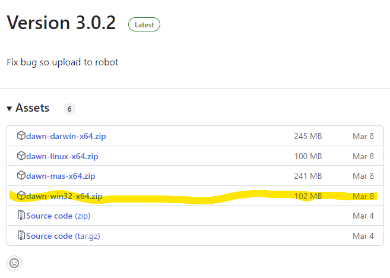
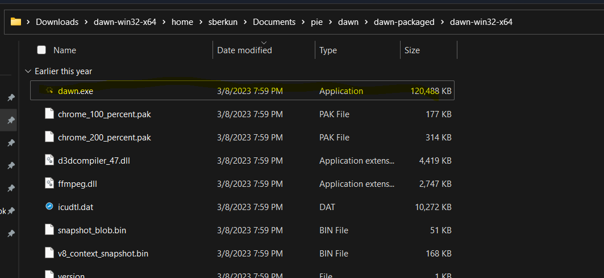

# Dawn Tutorial

Dawn is an essential tool for interfacing with your robot. It is a code editor with features that allow you to upload and download code from your robot. Dawn will also display information about any connected PiE device for example a motor controller or a limit switch. In this tutorial you will learn how to install dawn and upload .

# Getting Started

To install dawn you will need a couple of prerequisites
- a mac, linux, or windows computer
- install of dawn

## Installing Dawn

To install Dawn, go to https://github.com/pioneers/dawn/releases/ and install the latest release for your corresponding operating system. Extract the file using your operating system's unzipping method and then follow the next os specific steps

## Windows
To install the windows version first download your correct version highlighted below.


After installing dawn-win32-x64.zip unzip the folder. On Windows, you can do this by right clicking on the ZIP file and selecting "Extract all."

Extracting the ZIP file will create a new folder. Open this folder and find the file "Dawn.exe" (Windows) click on it to start Dawn.



## Linux

After installing the dawn-linux-x64.zip unzip to your desired install directory. Then with the shell open use the commands

```console
user@pc:~$ cd [dawn parent directory]\home\sberkun\Documents\pie\dawn\dawn-packaged\dawn-linux-x64
```

After changing the parent directory to match your own install. This command will put you into the working directory of dawn. From there you can start the program by running the script using the following command

```console
user@pc:~$ ./dawn
```

Assuming you have a linux gui, the program will run displaying dawn
# Dawn Instructions

After installing Dawn you will be presented with Dawn, as well as a interactive guide you can access by clicking on the "Tour button"


The tour will go through all of the special features of dawn including the run modes. 

## Getting Connected

To connect to your robot you will need to know your teams number and your router password. TO connect to your robot, you will first have to connect to your team's router. To do this find the router for your team. Your router should be named "team" followed by your team number, for example "team40". Then find the password located on the back of your router and connect to the network.

Next with dawn open, navigate to the `robot ip` indicated by this button . In the opened screen fill in the information for the IP Address and SSH Address. This can depend on your team but it will usually be 192.168.0.[`team number`] or by using team[`team number`].local

when filled out it should look similar to this:


Now with your information filled out press the update button to save your settings and wait until dawn shows that it's connected to your robot.