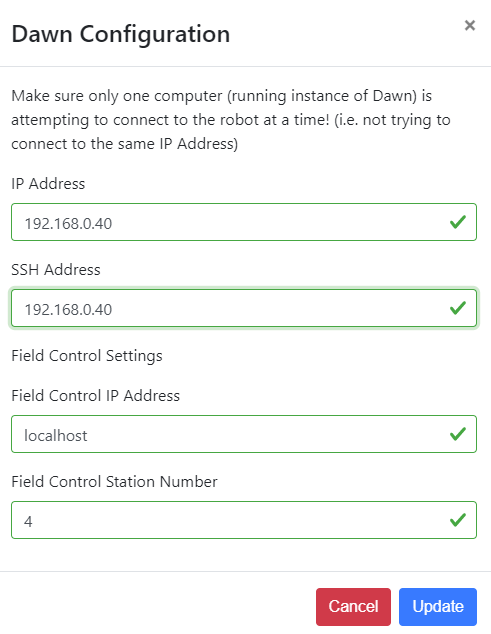
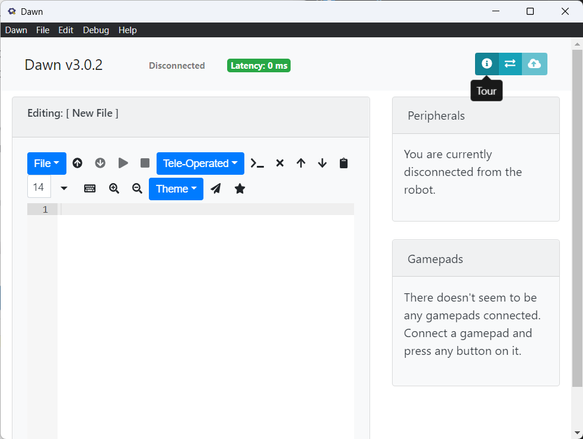

# Dawn Tutorial
In this tutorial you will install dawn and create your first student code file using the Student API. 

This tutorial is intended for beginners to the Student API and it's functions.

# Getting Started

## Installing Dawn

To install Dawn, go to https://github.com/pioneers/dawn/releases/ and install the latest release for your coresponding operating system. 

## Windows

After installing dawn-win32-x64.zip unzip the folder. On Windows, you can do this by right clicking on the ZIP file and selecting "Extract all."

Extracting the ZIP file will create a new folder. Open this folder and find the file "Dawn.exe" (Windows) click on it to start Dawn.

## Linux

## MacOS

# Dawn Instructions

After installing Dawn you will be presented with Dawn, as well as a interactive guide you can access by clicking on the "Tour button" 

To go through the guide, click on the red button after pressing 